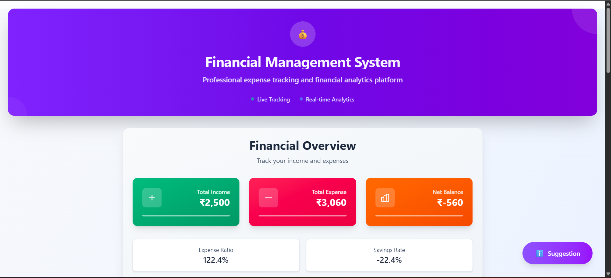
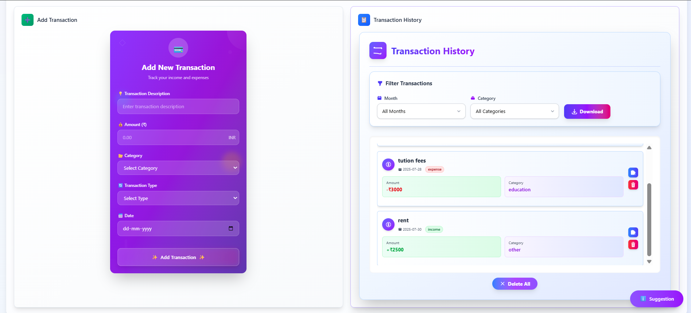
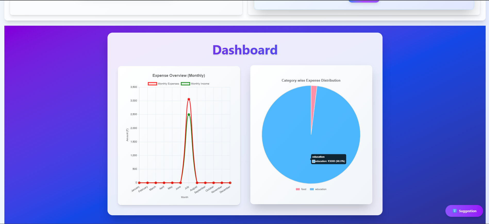
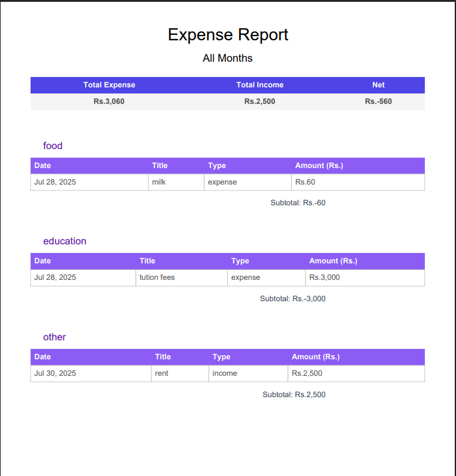
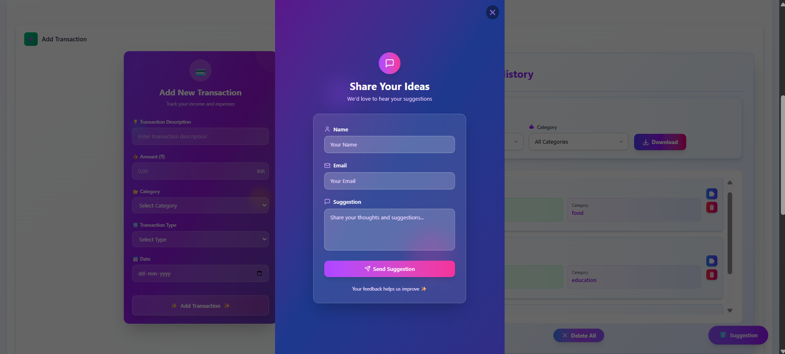

# 💰 Smart Spend – Expense Tracker

A feature-rich and modern expense tracker to manage your income and spending with insightful visuals and persistent data storage.

---

## 🧠 Overview

✨ Track your daily expenses and income  
📅 Filter by month for better visibility  
📊 Analyze your spending via charts  
💾 Data persists using Redux Persist  
📤 Email reports using EmailJS  
📄 Generate and download reports as PDF using **pdf.js**

---

## 🛠️ Tech Stack

- ⚛️ React  
- 🎨 Tailwind CSS  
- 🧱 Redux Toolkit  
- 💾 Redux Persist  
- 📧 EmailJS  
- 📈 React Chart.js 2  
- 📝 PDF.js (for PDF generation and downloading)

---
## 🖼️ Screenshots

### 📊 Display Board  

### ➕ Add Expense  

### 🧮 Dashboard  

### 📥 PDF Download  

### suggestion

---

----

# 1️⃣ Clone the repository
git clone https://github.com/Harshal-belgamwar/Smart-Spend 
cd Smart-Spend

# 2️⃣ Install core dependencies
npm install

# 3️⃣ Install Redux Toolkit, React Redux, and Redux Persist
npm install @reduxjs/toolkit react-redux redux-persist

# 4️⃣ Install EmailJS for sending emails
npm install @emailjs/browser

# 5️⃣ Install Chart.js for graphs
npm install chart.js react-chartjs-2

# 6️⃣ Install jsPDF for PDF downloads
npm install jspdf

# 7️⃣ start the server
npm run dev
 

👤 Author 
👨‍💻 Harshal Belgamwar 
🎓 Computer Engineering Student,PICT 
📍 Pune, India 
📧 harshalbelgamwar@gmail.com 
🔗 www.linkedin.com/in/harshal-belgamwar 

